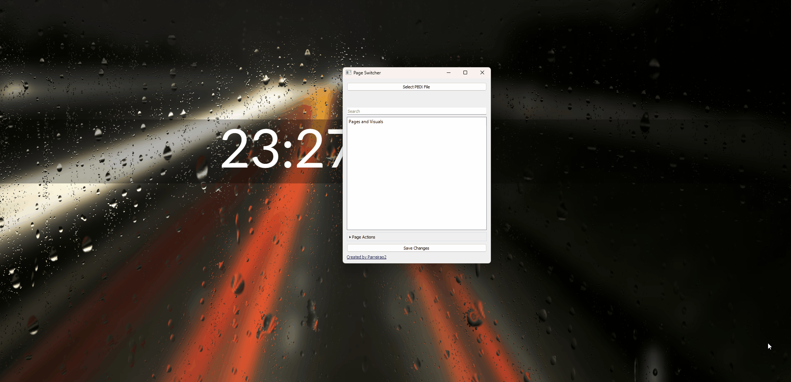
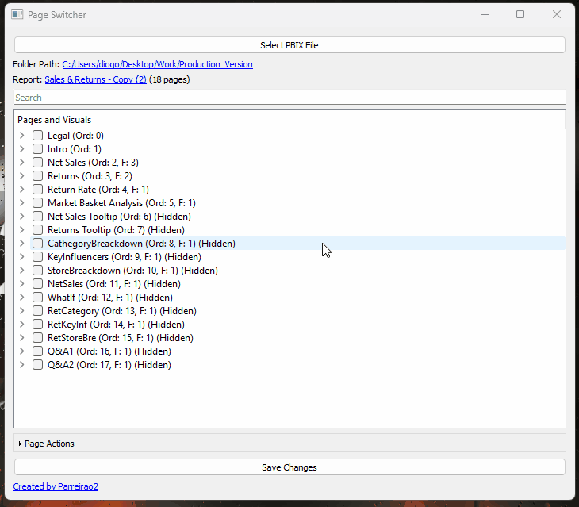
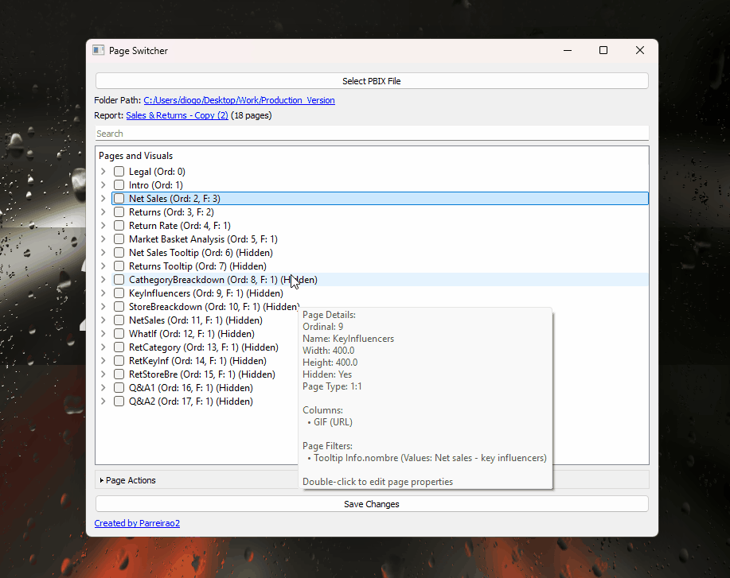
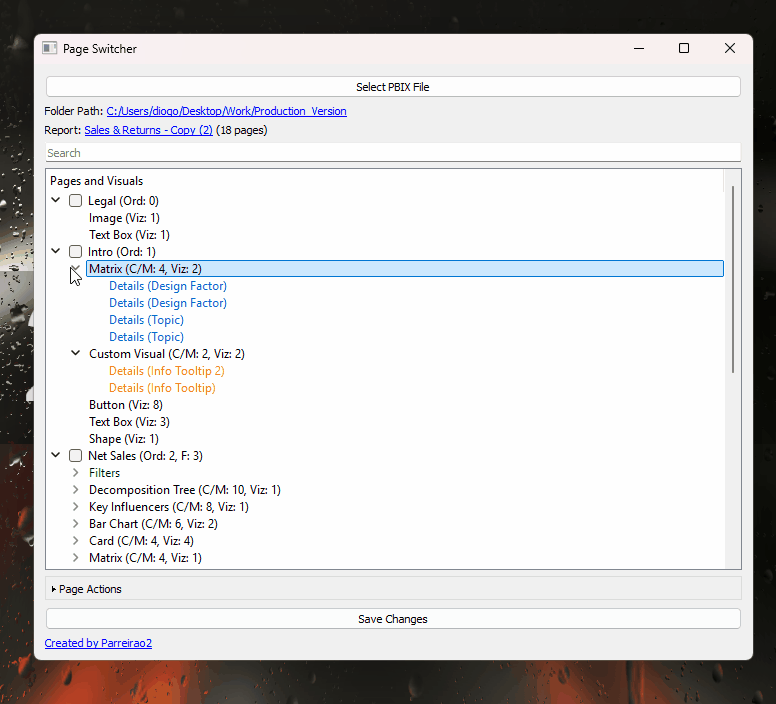
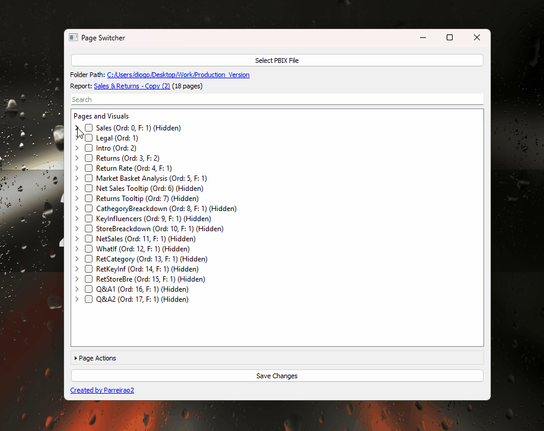
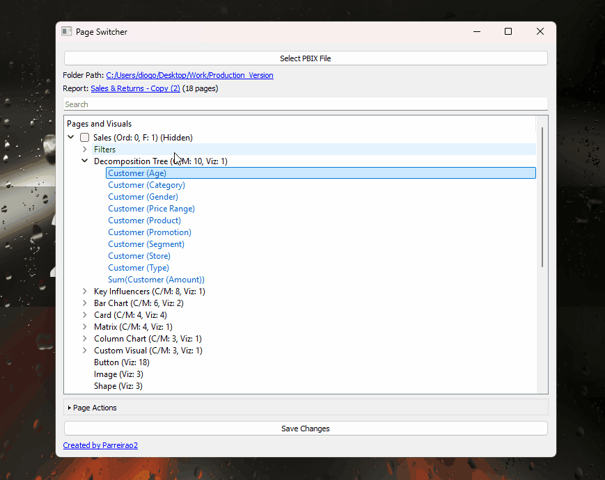
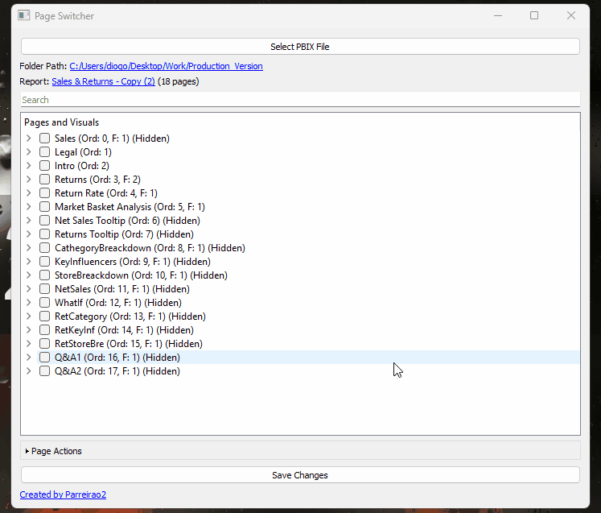
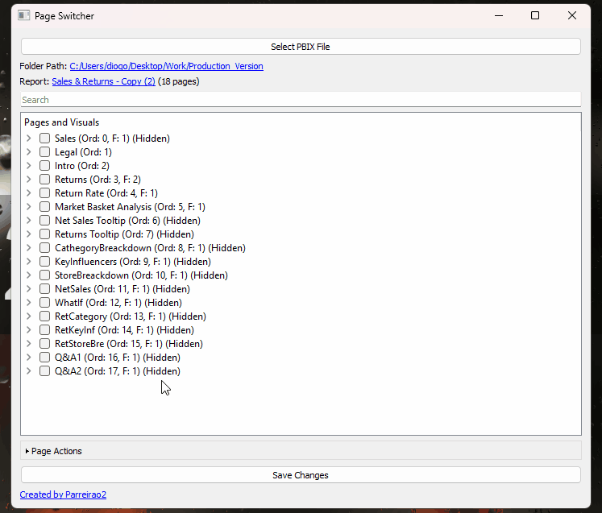
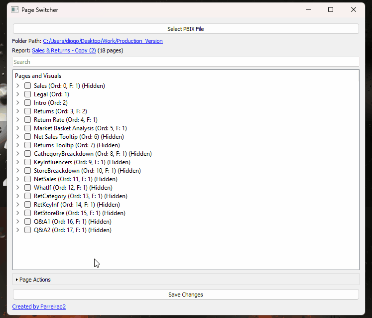
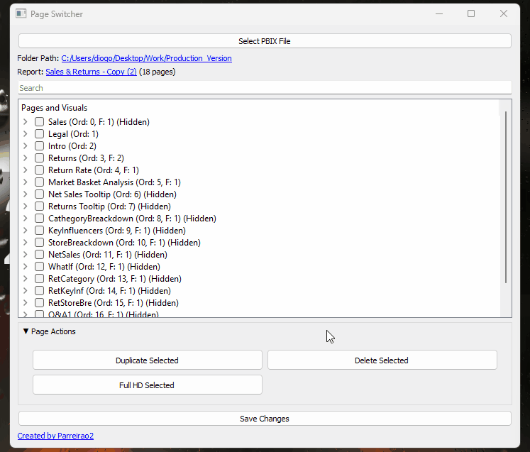

### Hi, my name is Diogo Parreirão!

I like creating cool and useful python scripts  I hope you can find something useful in here.

---

# Current Projects:

## Index

- [PageSwitcher](#pageswitcher)
  - [Report Page Overview](#report-page-overview)
  - [Page Exploration](#page-exploration)
  - [Page Editing](#page-editing)
  - [Visual Editing](#visual-editing)
  - [Filter Management](#filter-management)
  - [Measure and Column Tracking](#measure-and-column-tracking)
  - [Advanced Search](#advanced-search)
  - [Page Actions](#page-actions)
  - [Full HD Page Format](#full-hd-page-format)
  - [Secure Saving](#secure-saving)
  - [Download](#pageswitcher-download)
- [InfoHelper](#infohelper)
  - [Features](#infohelper-features)
  - [Download](#download-InfoHelper)
- [Sample Generator](#sample-generator)
  - [How to Use](#sample-generator-how)
  - [Download](#sample-generator-download)
- [Excel Validator](#excel-validator)
  - [How to Use](#excel-validator-how)
  - [Download](#excel-validator-download)

## PageSwitcher (for Power BI (.pbix) files)

PageSwitcher is a powerful tool designed to simplify the process of managing and transforming Power BI reports connected to local models. With PageSwitcher, you can effortlessly modify your reports without needing to access Power BI directly. The application is user-friendly, efficient, and continuously evolving to meet your needs.

### Features:
PageSwitcher is a powerful tool designed to simplify the process of managing and transforming Power BI reports connected to local models. With PageSwitcher, you can effortlessly modify your reports without needing to access Power BI directly. The application is user-friendly, efficient, and continuously evolving to meet your needs.

#### Report Page Overview

Upon loading your report, all pages will be listed for easy navigation. By hovering over any page, a detailed summary is displayed, including:

- **Ordinality**
- **Name**
- **Width and Height**
- **Page Type**
- **Measures and Columns used on the page**

---

#### Page Exploration

Expand each page to gain insights into the visuals contained within. You can view:

- Visual elements used on the page
- Number of visuals ("Viz:")
- Detailed information on measures and columns used within each visual

---

#### Page Editing

Easily edit page properties by double-clicking on a page to open a pop-up window where you can modify:

- **Ordinality**
- **Name**
- **Width and Height**
- **Visibility (Hidden/Visible)**
- **Page Type** (default Power BI page types)
- **Filters applied to the page**

---

#### Visual Editing

Double-clicking on a visual allows you to modify its properties via a dedicated pop-up window. Available properties include:

- **Position (X and Y coordinates)**
- **Size (Width and Height)**
- **Visual Type and Name**
- **Drill-Through (Enable/Disable)**
- **Fields containing measures or columns**
- **Visual position on the page**
- **Edit visual theme and JSON code directly**

---

#### Filter Management

Manage filters with ease by expanding the "Filters" section of any page, or by double-clicking the page name and modifying filter fields directly. *(Note: Deleting a filter text may leave an "Undefined" property when the report is reopened in Power BI.)*

---

#### Measure and Column Tracking

Quickly locate where specific measures or columns are used across all pages and visuals by double-clicking on them.

---

#### Advanced Search

Find anything in your report with the advanced search feature. Search for:

- Page names
- Filters
- Columns and measures
- Visual names, and more

---

#### Page Actions

PageSwitcher offers bulk actions to manage pages efficiently:

- **Delete** or **Duplicate** multiple pages
- Duplicated pages are added to the bottom to maintain the original ordinal order, which can be adjusted later as needed

---

#### Full HD Page Format

Easily convert all or selected pages to Full HD format with a single click. Since Power BI doesn't offer this by default, PageSwitcher provides a simple solution.

---

#### Secure Saving

When saving your edited report, a new version is created, ensuring the original file remains untouched. This safeguard ensures data integrity and peace of mind while using the tool.

### [Download PageSwitcher](#pageswitcher-download)

[Latest Version](https://github.com/Parreirao2/Power-BI-Tools/releases/tag/PageSwitcher)

## InfoHelper

[InfoHelper](#infohelper) is a C# Script that you can import to your Tabular Editor and use as a macro by right-clicking on any column and see its specific profile analysis.

Currently, the script works on columns of the type: Strings, Int64, DateTime, and Boolean.
Each column type has a specific analysis based on its type, and each type has a set of already created DAX Measures that you can easily copy/paste from the pop-up window and use to create as a new measure. These Measures already show their results, so you can know what output to expect when creating them.

The script is created in a user-friendly code structure that you can easily edit and adapt to your liking. The code for each measure is written in DAX so that you don't need to know C# to add your own analysis, you can just type your DAX Measure!

### [InfoHelper Features](#infohelper-features)

String Columns Analysis:

Calculates the count and percentage of blank rows.
Calculates the count and percentage of error rows.
Outputs column information including name, description, format string, data type, and visibility.

DateTime Columns Analysis:

Determines the first and last dates.
Calculates the earliest and latest dates.
Computes the number of unique days and distinct date count.
Counts occurrences for each day of the week.
Calculates the count and percentage of blank and error rows.
Outputs detailed column information and statistics.

Int64 Columns Analysis:

Calculates maximum, minimum, and range.
Computes average, sum, and distinct count.
Determines the count of non-null values and total rows.
Calculates median, standard deviation, variance, and percentiles.
Calculates the count and percentage of blank and error rows.
Outputs detailed column information and statistics.

### How to use:

- Open Tabular Editor and load your model.
- Click on C# Script
- Paste the Script code
- Click on +
- Name the Macro
- Select Column from the list and click OK

Run the Script:
The script will iterate through each selected column by simply:
- Right-Clicking a column
- Select Macros and then choose the new script

- Depending on the data type of each column, it will perform the respective analysis.
- The results will be displayed in an output window that can be copy/pasted anywhere you want.

### [Download it here](download-InfoHelper):
[Latest Version](https://github.com/Parreirao2/Power-BI-Tools/tree/main/InfoHelper)

## [Sample Generator + SQL Tools](#sample-generator)

This script provides a user-friendly interface for SQL query analysis, CSV generation, and SQL CREATE TABLE statement generation. It combines the power of PyQt5 for the GUI, Faker for data generation, and regular expressions for SQL parsing and suggestions.

- Find specific words in a SQL query and provide suggestions. This could be useful on very large SQL Queries, by providing each line number and each statement where the word was found.
- Generate CSV files with random data of different sample types. You can choose to generate a .csv with as many rows as you'd like, and define which template to use from the following: Personnel, Financial, Employee, and Customer.
- Upload a CSV file and generate a SQL CREATE TABLE statement based on its contents. The script will automatically determine the datatype of each column and provide an already "ready to run" query.

### [How to use](#sample-generator-how):

Find Words:
- Use the first box to enter each word you want to search for, separated by commas ",".
- Use the second box to enter your Query
- Click on "Find Words"

Note: Currently Search Suggestions is a Work-In-Progress

Create Table:
- Click Upload CSV
- Profit.

Generate CSV:
- Use the first box to define how many rows you want your CSV file to have
- Choose the Sample type from the dropdown list
- Click Generate CSV
- Choose the location where you want to save this .csv

### [Download Sample Generator](#sample-generator-download)

[Latest Version](https://github.com/Parreirao2/Power-BI-Tools/releases/tag/SQLTools)

## [Excel Validator](#excel-validator)
This script is intended to validate the integrity of multiple .csv files in bulk. Providing an analysis on mismatch types (via graphs), per file.
The goal is for the user to define a structure of a sample excel file format by defining column names and their expected types (ex: String, int64, Float, etc...). The script will then check every .csv in a folder and compare their types and nomenclature and provide a short analysis on each type, identifying the number of errors, the row numbers, and the columns with the most errors.

### Example output:

Analyzing 1.csv:
  Missing Columns: []
  Extra Columns: []
  Column Order Correct: True
  Column Order Differences: []
  Blank Values: 0
  Rows with Blanks: []
  Data Types:
Name         object
Address      object
Phone        object
DOB          object
Salary        int64
Category     object
Job Title    object
Company      object
dtype: object
  Rows with Incorrect Data Types: {'Phone': [0, 1, 2, 3, 4, 5, 6, 7, 8, 9, 10, 11, 12, 13, 14, 15, 16, 17, 18, 19, 20, 21, 22, 23, 24, 25, 26, 27, 28, 29, 30, 31, 32, 33, 34, 35, 36, 37, 38, 39, 40, 41, 42, 43, 44, 45, 46, 47, 48, 49, 50, 51, 52, 53, 54, 55, 56, 57, 58, 59, 60, 61, 62, 63, 64, 65, 66, 67, 68, 69, 70, 71, 72, 73, 74, 75, 76, 77, 78, 79, 80, 81, 82, 83, 84, 85, 86, 87, 88, 89, 90, 91, 92, 93, 94, 95, 96, 97, 98, 99], 'Salary': [0, 1, 2, 3, 4, 5, 6, 7, 8, 9, 10, 11, 12, 13, 14, 15, 16, 17, 18, 19, 20, 21, 22, 23, 24, 25, 26, 27, 28, 29, 30, 31, 32, 33, 34, 35, 36, 37, 38, 39, 40, 41, 42, 43, 44, 45, 46, 47, 48, 49, 50, 51, 52, 53, 54, 55, 56, 57, 58, 59, 60, 61, 62, 63, 64, 65, 66, 67, 68, 69, 70, 71, 72, 73, 74, 75, 76, 77, 78, 79, 80, 81, 82, 83, 84, 85, 86, 87, 88, 89, 90, 91, 92, 93, 94, 95, 96, 97, 98, 99]}
  Column with Most Errors: Phone (100 errors)
  Suggested Corrections: {}

This is still a proof of concept, only used on a specific project of mine, but hopefully it could be useful to someone else.

### [How to use](#excel-validator-how):
- Select Folder with Excel/CSV files (the folder with the files you'd like to check)
- Select the Template Excel File (the file which defines the expected structure)
- There will be 2 tabs for each csv file.
  	- One with the analysis
  	- One with a graph displaying Number of Errors vs Column name
- After the analysis finishes, you can export it as an excel file with a format ready to be read by a BI tool.

- I've provided some samples that could be used to better understand how the tool works, [here](https://github.com/Parreirao2/Power-BI-Tools/tree/main/ExcelValidator/SampleFiles).

---

### [Download ExcelValidator](#excel-validator-download)

[Latest Version](https://github.com/Parreirao2/Power-BI-Tools/releases/tag/ExcelValidator)
